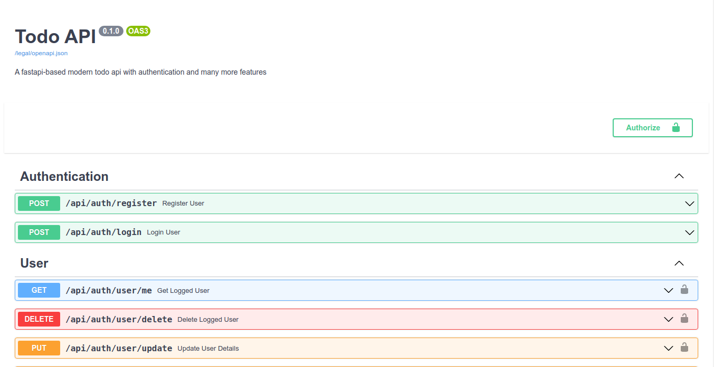
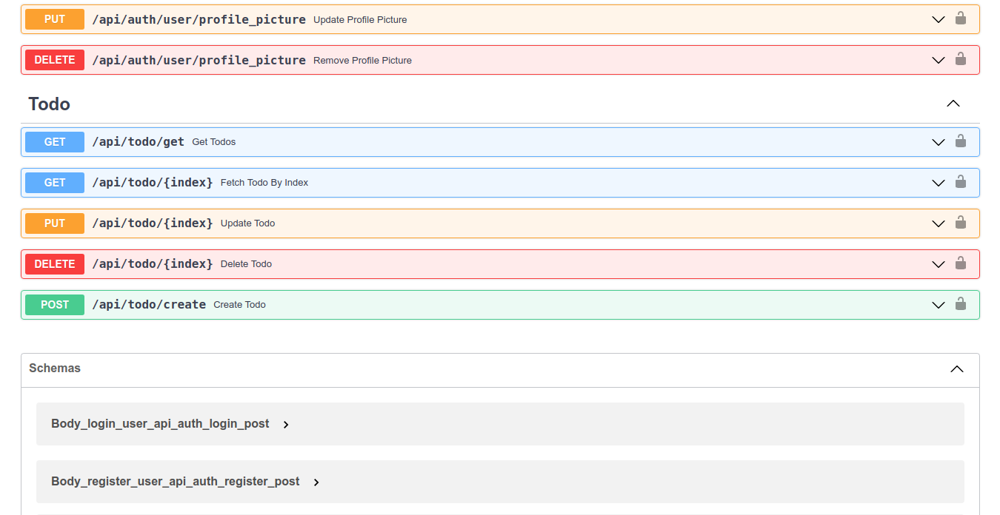
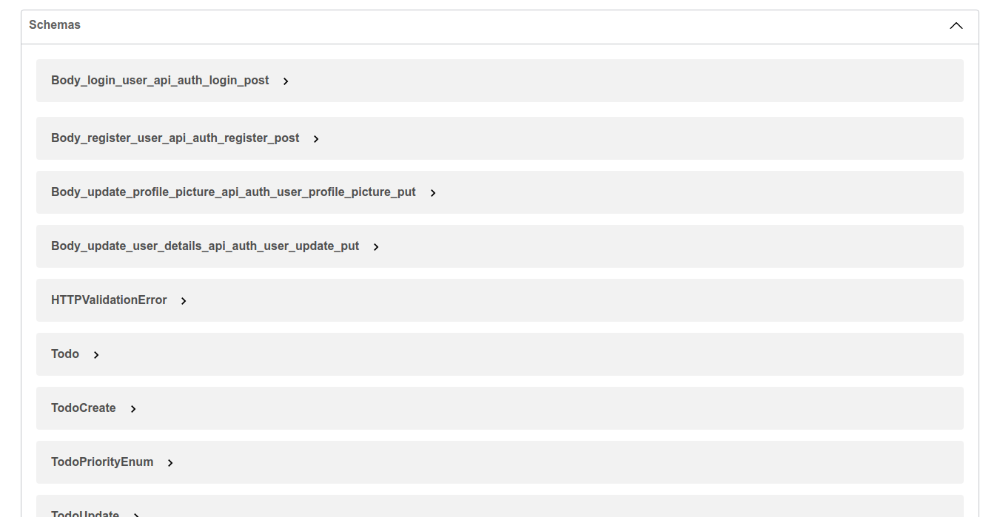

# Todo API

A simple **Todo App** api made using [Fast API](https://fastapi.tiangolo.com/) and [MongoDB](https://www.mongodb.com/)


## Screenshots






## Introduction

>  *I built this API on my own to learn to handle **CRUD** operations, database, authentication etc in fastapi. This API is not production ready rightnow. There are still few more features to implement, few bugs and need to add more comments. Use it carefully!*

## Documentation

### Installation

- Clone the repository to local machine
- Make sure have Python 3.6+ installed in your PC
- run ```cd Todo-API```
- run ```pip install -r requirements.txt```

Now all the requirements are installed but you still need to create a ```.env``` file to store enviroment variables in ```/app``` directory.

- run ```touch app/.env```

Copy the following code and paste it inside the file and save the file

```
JWT_SECRET="SET YOUR OWN JWT SECRET HERE"
JWT_ALGORITHM=HS256
```

Now run ```cd ..``` to get back to parent directory.

> You can skip this step if you want to run this API locally and have mongodb installed without any password set.

Now you need to go to ```app/core/config.py``` and change
```python
MONGODB_URL: AnyUrl = "mongodb://127.0.0.1:27017/"
```

To

```python
MONGODB_URL: AnyUrl = "YOUR MONGODB URL"
```

Hurray🎉!! Everything is setup in your PC to run TodoAPI

Now just type in your terminal

```
uvicorn app.main:app --reload --port 8080
```

This starts the uvicorn server and now you are ready to go
🥳!!

> Note: If running the last command shows ```port already in use error```, then change the ```port``` from ```8080``` to any other free port.

As this API is made using FastAPI, which has this awesome automatic documentation generation feature, There is no other documentaiton available.

Click here to go to [auto-generated documentation](http://127.0.0.1:8080/documentation#/).